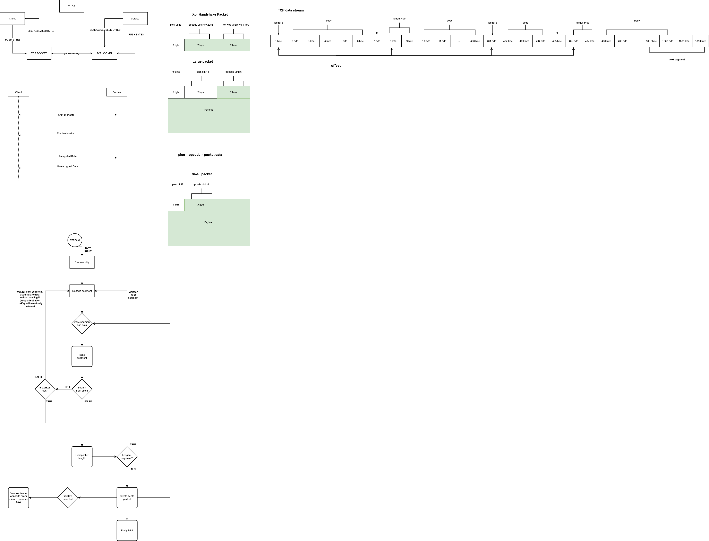

# Shine Online Packet Sniffer

> Tool that captures all packets between the client and services and show them in real time.
>
>
 [](https://goreportcard.com/report/github.com/shine-o/shine.engine.packet-sniffer)
 


#### Requirements

- Install [NMAP](https://nmap.org/download.html)
- Adjust the **config/.sniffer.yml** file to your needs


## build

 ``` 
 $ go build -o sniffer.exe
 ```

## sniffer capture

Start capturing and decoding packets

### Synopsis

Start capturing and decoding packets

```
e.g, server side capture:

$ .\sniffer.exe capture --config "config/.server.config.yml"
```

### Options

```
  -h, --help   help for capture
```

### Options inherited from parent commands

```
      --config string   config file (default is $HOME/.sniffer.yaml)
```


#### Packet info


